Name: Abdul Saboor Hamedi
NIM: 241012050123
Class: Regular B
Subject: ADVANCED NLP

# Hybrid Search: Fine-Tuning Retrieval Using LDA and BERT

### Introduction

Have you ever tried to search for something important, and the computer just could not find what you were looking for? Maybe you searched for "machine learning" but the computer only found documents that said the exact words "machine learning," and it completely missed a document that talked about "artificial intelligence" or "neural networks." This is one of the biggest problems in information retrieval, and it is called the "vocabulary mismatch problem." It happens because computers are very good at matching exact words, but they are not very good at understanding what those words actually mean.

For a very long time, search engines relied on simple methods like counting how many times a word appears in a document. These methods are called "keyword-based" or "lexical" methods. The most famous one is TF-IDF, which stands for Term Frequency-Inverse Document Frequency. This method looks at how often a word appears in a document and compares it to how rare that word is across all documents. This way, it can find documents that have the specific words you are looking for. For example, if you search for "gradient descent," the computer will look for documents that contain those exact words and rank them higher. This works really well when you know exactly what words to use.

But what happens when you do not know the exact words? What if you search for "how do computers learn from data" and the documents use words like "training algorithms" or "supervised learning"? A keyword search would miss those documents because the words do not match exactly. This is where modern AI comes in. Newer methods like BERT (which stands for Bidirectional Encoder Representations from Transformers) can understand the meaning behind your words. BERT reads your query and tries to understand what you really mean, not just what you literally said. It looks at the context of every word and figures out the deeper intent.

The problem is that BERT also has its own weaknesses. Sometimes it is too broad and brings back documents that are vaguely related but not exactly what you need. It can also be slow because it has to do a lot of math to understand every single query. And sometimes it is hard to understand why BERT ranked a certain document highly because the reasoning happens inside a complex neural network that is hard to explain.

So here is the big question: What if we could combine the best parts of both methods? What if we could use keyword matching for the parts where it is strong (speed and precision) and use AI for the parts where it is strong (understanding meaning and context)? This is exactly what we did in this project. We built a Hybrid Search Engine that uses both methods at the same time and combines their results into a single, powerful search experience.

In this journal, we will walk through the entire journey of building this system. We started with a collection of academic PDF documents about artificial intelligence, machine learning, and mathematics. We cleaned the text, broke it into smaller pieces called chunks, and stored everything in a database. Then we built two different search methods: one that finds exact keywords using PostgreSQL's full-text search (we call this the "Muscle"), and one that understands meaning using Sentence Transformers (we call this the "Brain"). We also added Topic Modeling using LDA and BERT to help organize our documents into themes and categories. Finally, we combined everything together into a system that can find documents faster, smarter, and more accurately than any single method on its own.

Our results were impressive. We found that the hybrid approach gave us much better search results than using either method alone. When a user searched for something like "how to learn with ai," the system not only found documents with those exact words, but it also found documents about AI in education, machine learning for students, and the impact of technology on learning. The system understood what the user was really asking for. And it did all of this in under one second. In our tests, the semantic (AI) search took about 257 milliseconds, the keyword search took about 551 milliseconds, and the fusion process that combined them took less than half a millisecond. The total time was just 809 milliseconds. That means the system read and understood hundreds of documents and returned the best results in less time than it takes to blink your eyes.

This project is important because it shows that we do not have to choose between old methods and new methods. We can use both together to build something better. As Liang et al. (2025) showed in their research, combining different types of models can lead to much better performance than using any single model alone. The same principle applies here. By combining the Muscle of keyword search with the Brain of AI understanding, we created a search engine that is fast, accurate, and trustworthy.

### System Architecture Overview

Before we dive into the details, here is a complete diagram of our system. This shows the entire journey from a PDF document entering the system to a user getting their search results. Follow the flow from top to bottom:

```mermaid
flowchart LR
    %% ===== TEXT PROCESSING (Blue) =====
    subgraph Processing["Text Processing Pipeline"]
        direction LR
        Clean["Text Cleaning<br/>11-step pipeline"] --> Chunk["Text Chunking<br/>500 chars, 50 overlap"] --> Lang["Language Detection<br/>langdetect"] --> Embed["Embedding Generation<br/>SentenceTransformer<br/>384-dim vector"]
    end

    %% ===== DATABASE (Red) =====
    subgraph Storage["Database Layer"]
        direction LR
        DB[("PostgreSQL + pgvector")]
        FTS_Index["Full-Text Search Index<br/>tsvector + GIN"]
        Vec_Index["Vector Search Index<br/>HNSW + cosine"]
    end

    %% ===== USER QUERY =====
    User["User Query"]

    %% ===== SEARCH PIPELINE (Purple) =====
    subgraph Search["Search Pipeline"]
        direction LR
        Q_Encode["Query Encoding<br/>SentenceTransformer"]
        KW_Query["Keyword Query<br/>plainto_tsquery"]
        Vec_Search["Vector Search<br/>cosine >= 0.15"]
        BM25_Search["BM25 Search<br/>ts_rank"]
        Norm1["Normalize Scores"]
        Norm2["Normalize Scores"]
    end

    %% ===== FUSION (Orange) =====
    subgraph Fusion["Fusion Engine"]
        direction LR
        Scorer["HybridScorer<br/>alpha = 0.5"] --> Strategy["Fusion Strategy<br/>linear / CombSUM / CombMNZ"] --> Ranked["Ranked Results"]
    end

    %% ===== ANALYTICS (Green) =====
    subgraph Analytics["Analytics Layer"]
        direction LR
        LDA["LDA Topic Model<br/>Gensim"]
        BERT["BERT Topic Model<br/>KMeans"]
        Sentiment["Sentiment Analysis<br/>VADER"]
        TopicLabels["Topic Labels & Keywords"]
    end

    %% ===== OUTPUT =====
    Output["Final Output<br/>Web UI / CLI"]

    %% ===== CONNECTIONS =====

    %% Processing to Storage
    Embed --> Vec_Index
    Chunk --> FTS_Index
    Vec_Index --> DB
    FTS_Index --> DB

    %% User to Search
    User --> Q_Encode --> Vec_Search
    User --> KW_Query --> BM25_Search

    %% DB to Search
    DB --> Vec_Search
    DB --> BM25_Search

    %% Search to Fusion
    Vec_Search --> Norm1 --> Scorer
    BM25_Search --> Norm2 --> Scorer

    %% DB to Analytics
    DB -.-> LDA
    DB -.-> BERT
    DB -.-> Sentiment
    LDA --> TopicLabels
    BERT --> TopicLabels

    %% Fusion and Analytics to Output
    Ranked --> Output
    TopicLabels -.-> Output

    %% ===== STYLES =====
    classDef processing fill:#e3f2fd,stroke:#1565c0,stroke-width:2px
    classDef storage fill:#fce4ec,stroke:#c62828,stroke-width:2px
    classDef search fill:#f3e5f5,stroke:#7b1fa2,stroke-width:2px
    classDef fusion fill:#fff3e0,stroke:#ef6c00,stroke-width:2px
    classDef analytics fill:#e8f5e9,stroke:#2e7d32,stroke-width:2px
    classDef output fill:#f5f5f5,stroke:#616161,stroke-width:2px

    class Clean,Chunk,Lang,Embed processing
    class DB,FTS_Index,Vec_Index storage
    class User,Q_Encode,KW_Query,Vec_Search,BM25_Search,Norm1,Norm2 search
    class Scorer,Strategy,Ranked fusion
    class LDA,BERT,Sentiment,TopicLabels analytics
    class Output output
```



The diagram above shows how our system works from start to finish. First, we clean the text and break it into small pieces called chunks. Then each chunk gets turned into a set of numbers (an embedding) that captures its meaning, and everything is stored in a database. When you type a search, the system does two things at once: one part looks for matching keywords (like a regular search engine), and another part uses AI to find documents with similar meaning. It combines both results into one ranked list. We also have a separate part that figures out what topics the documents are about and how positive or negative they sound. The whole thing is built so each piece works independently, making it easy to fix or improve any single part without breaking the rest.

### How We Built the System

Before we could build our search engine, we needed to get our documents ready. This is called the preprocessing stage, and it is one of the most important parts of any Natural Language Processing project. If the data going in is messy, the results coming out will be messy too. Think of it like cooking: if you start with bad ingredients, you cannot make a good meal, no matter how good your recipe is.

#### Collecting the Documents

We gathered a collection of academic PDFs about artificial intelligence, machine learning, deep learning, and mathematics. These were real research papers from various sources. Some of them were in English, and some of them were in other languages like Persian and Indonesian. This made our project more interesting because we had to handle multiple languages at the same time.

#### Parsing the PDFs

The first step was to extract the text from the PDF files. This is harder than it sounds because PDFs are not really designed for text extraction. They are designed for printing, which means the text is stored as positions on a page rather than as a continuous story. We used a library called `unstructured` to partition the PDFs into individual elements like paragraphs, headings, and lists. We used the "fast" strategy because we did not need to extract images or tables. We just wanted the raw text.

#### Cleaning the Text

Once we had the raw text, we needed to clean it. PDFs often have strange characters, broken words, extra spaces, and formatting artifacts that make the text hard to work with. We built a cleaning pipeline that does the following:

| Step | What It Does | Why It Matters |
| :--- | :----------- | :------------- |
| Unicode Normalization | Converts characters to their standard form | Fixes weird symbols and characters from PDFs |
| Remove URLs and Emails | Deletes web addresses and email IDs | These are not useful for search |
| Fix Hyphenated Words | Reunites words broken across lines like "comput- ation" into "computation" | Keeps vocabulary intact |
| Remove Page Numbers | Strips standalone numbers like "23" or "Page 23" | Prevents false matches |
| Collapse Spaces | Replaces multiple spaces with a single space | Makes the text clean and uniform |
| Remove Special Symbols | Deletes mathematical symbols and control characters | Keeps only meaningful text |

#### Chunking the Text

After cleaning, we broke the text into smaller pieces called chunks. This is important because AI models cannot process very long documents all at once. They have a limit on how much text they can handle. We used a chunk size of 500 characters with an overlap of 50 characters between chunks. This means that the first chunk goes from position 1 to 500, the second chunk goes from 450 to 950, the third goes from 900 to 1400, and so on. The overlap ensures that we do not lose any important information that might fall right at the boundary between two chunks. It is like overlapping tiles on a roof to make sure there are no gaps.

#### Detecting the Language

For each chunk, we detected the language using a library called `langdetect`. This is useful because different languages need different processing. For example, English text uses spaces between words, but some other languages do not. The language detection also helps when we display search results, because we can show the reader what language the document is in.

#### Generating Embeddings

The most important part of the AI pipeline is generating embeddings. An embedding is a mathematical representation of text. It is a vector (a list of numbers) that captures the meaning of the text. The key idea is that similar texts will have similar vectors. For example, the sentence "I love dogs" and the sentence "I like puppies" will have vectors that are close to each other in mathematical space because they have similar meanings.

We used a model called `paraphrase-multilingual-MiniLM-L12-v2` from the Sentence Transformers library. This model takes a piece of text and turns it into a vector of 384 numbers. We chose this model because it is fast, small, and supports multiple languages. It can understand English, Persian, Indonesian, and many other languages, which is perfect for our multilingual collection.

#### Storing Everything in the Database

Finally, we stored all of this data in a PostgreSQL database with the pgvector extension. PostgreSQL is a very popular and reliable database, and pgvector allows us to store and search vectors efficiently. We created two tables:

1. The `document` table stores the text content, the language, and a special full-text search index for keyword matching.
2. The `document_embedding` table stores the 384-dimensional embedding vector for each document.

We also added a special index called HNSW (Hierarchical Navigable Small World) on the embeddings. This index makes it very fast to find similar vectors. Instead of comparing the query vector to every single document (which would take a long time), the index organizes the vectors in a smart way so that we can quickly find the nearest neighbors. Think of it like a library catalog: instead of searching every shelf, you go straight to the right section.

### Part 1: The Muscle - How Keyword Search Works

Now that we have all our documents stored and organized, let us talk about the first search method: keyword search. We call this the "Muscle" of our system because it is strong, fast, and direct. It finds exactly what you asked for, no more and no less.

#### How PostgreSQL Full-Text Search Works

PostgreSQL has a built-in feature called full-text search (FTS). It works by creating something called a `tsvector` for each document. A `tsvector` is a sorted list of all the important words in a document, with information about where they appear. When we insert a document, we create a `tsvector` from its content and store it in the `content_tsvector` column. This is done automatically using a database trigger that fires whenever a new document is added.

When a user searches for something, PostgreSQL converts the query into a `tsquery` using the `plainto_tsquery` function. This function takes the user's words and turns them into a search pattern. Then it uses the `ts_rank` function to rank all the documents based on how well they match the query. The ranking considers things like how many times the search words appear in the document and how close together they are.

For example, if a user searches for "how to learn with ai," PostgreSQL will:
1. Remove common words like "how" and "to" (these are called stop words)
2. Keep the important words like "learn" and "ai"
3. Find all documents that contain "learn" and "ai"
4. Rank them based on how relevant they are

We use the English dictionary for this process, which means it also handles different forms of words. For example, searching for "learn" will also match "learning," "learned," and "learns." This is called stemming.

#### The SQL Query

Here is the actual SQL query that runs the keyword search:

```sql
SELECT d.id, d.content,
       ts_rank(to_tsvector('english', d.content), plainto_tsquery('english', %s)) AS rank,
       d.language, d.created_at
FROM document d
WHERE to_tsvector('english', d.content) @@ plainto_tsquery('english', %s)
ORDER BY rank DESC
LIMIT %s;
```

The `@@` operator checks if the document matches the query, and `ts_rank` calculates how relevant the match is. The result is a list of documents sorted by relevance, with the most relevant ones at the top.

#### The Strength of Keyword Search

The keyword search is incredibly fast. In our tests, it can search through thousands of documents in just a few milliseconds. It is also very precise. If a researcher is looking for a very specific term like "Gronwall's inequality" or "stochastic gradient descent," the keyword search will find the exact documents that mention those terms. This kind of precision is essential for technical research where exact terminology matters.

#### The Weakness of Keyword Search

However, the keyword search has a major weakness: it cannot understand synonyms or related concepts. If a user searches for "AI in education," the keyword search will only find documents that contain those exact words. It will miss documents that talk about "artificial intelligence in schools" or "machine learning for students," even though those documents might be exactly what the user needs. This is the vocabulary mismatch problem we talked about earlier.

To solve this problem, we need a second search method that understands meaning, not just words. This is where our "Brain" comes in.

### Part 2: The Brain - How AI Search Works

The second search method in our system is the AI-powered semantic search. We call this the "Brain" because it tries to understand what your words really mean, not just what they literally say. Instead of looking for exact word matches, it looks for documents that have a similar meaning to your query.

#### How Sentence Transformers Work

To understand semantic search, we first need to understand how Sentence Transformers work. A Sentence Transformer is a type of AI model that takes a sentence as input and produces a vector (a list of numbers) as output. The key property of this vector is that sentences with similar meanings will have similar vectors.

For example, if we take these three sentences:

- "Machine learning requires large amounts of data"
- "AI systems need lots of training examples"
- "The weather today is sunny and warm"

The first two sentences will have vectors that are close to each other in mathematical space, because they have similar meanings (both talk about AI and data). The third sentence will have a vector that is far away from the first two, because its meaning is completely different (weather).

This is an incredibly powerful idea. It means that if a user searches for "how computers learn," the system can find documents that talk about "machine learning algorithms" even though they do not share any exact words. The system understands the intent behind the query, not just the literal words.

#### How We Use It in Our System

Our semantic search works in three steps:

1. **Encode the Query**: When a user types a search query, we use our Sentence Transformer model to convert it into a 384-dimensional vector. This vector captures the meaning of the query.

2. **Find Similar Vectors**: We then search the database for document embeddings that are most similar to the query vector. We measure similarity using cosine similarity, which is a mathematical way to measure how close two vectors are. A cosine similarity of 1.0 means the vectors are identical (perfect match), and 0.0 means they are completely unrelated.

3. **Return the Results**: We return the documents with the highest similarity scores, sorted from most similar to least similar.

Here is the SQL query that does this:

```sql
SELECT d.id, d.content,
       (1 - (e.embedding <=> %s::vector)) AS similarity,
       d.language, d.created_at
FROM document d
INNER JOIN document_embedding e ON d.id = e.doc_id
WHERE (1 - (e.embedding <=> %s::vector)) >= %s
ORDER BY similarity DESC
LIMIT %s;
```

The `<=>` operator is the cosine distance operator from pgvector. We subtract it from 1 to convert distance into similarity. So a distance of 0 (identical vectors) becomes a similarity of 1 (perfect match), and a distance of 2 (opposite vectors) becomes a similarity of -1 (complete opposite).

We also have a threshold parameter (default 0.15) that filters out documents that are not similar enough. This prevents the system from returning completely irrelevant results.

#### The Strength of Semantic Search

The semantic search is excellent at understanding the intent behind a query. It can find documents that use different words but have the same meaning. This makes it much more flexible and intuitive than keyword search. A user does not need to know the exact technical terms to find what they are looking for.

For example, in our tests, a search for "how to learn with ai" returned documents about:
- Students using AI tools for learning
- AI shaping education across different ages
- The effectiveness of AI chatbots in teaching
- The impact of AI on academic performance

All of these documents are relevant to the query, even though they use different words. A keyword search would have missed many of them because they do not all contain the exact phrase "learn with ai."

#### The Weakness of Semantic Search

However, semantic search also has weaknesses. It is slower than keyword search because it requires running the AI model on every query. In our tests, the semantic search took about 257 milliseconds for a single query. This is still fast, but it is slower than the keyword search, which took just a few milliseconds.

Another weakness is that semantic search can sometimes be too broad. It might return documents that are vaguely related to the topic but not exactly what the user needs. For example, a search for "gradient descent optimization" might also return documents about general optimization algorithms, even though the user specifically wanted gradient descent.

Finally, semantic search can be hard to interpret. When you see the results, you might wonder "Why did this document rank so highly?" The reasoning happens inside a complex neural network with millions of parameters, and it is not always easy to explain why a particular document was considered relevant.

### Part 3: How We Combine Them - The Hybrid Search

Now here is where the magic happens. Instead of choosing between keyword search and semantic search, we use both of them together. We call this "Hybrid Search," and it is the core of our project.

#### The Fusion Process

When a user submits a query, our system does three things in parallel:

1. **Run the Keyword Search**: Find documents using PostgreSQL full-text search. This is fast and precise.
2. **Run the Semantic Search**: Find documents using AI-powered vector similarity. This is smart and understands meaning.
3. **Fuse the Results**: Combine the results from both searches into a single ranked list.

The fusion process is done by a component we call the `HybridScorer`. It works like this:

1. **Normalize the Scores**: The keyword search and semantic search produce scores in different ranges. The keyword search uses `ts_rank`, which produces scores like 0.1 or 0.5. The semantic search uses cosine similarity, which produces scores like 0.8 or 0.9. We cannot just add these together because they are on different scales. So first, we normalize all scores to be between 0 and 1. We do this using a "max normalization" method, where we divide each score by the highest score in its group. This way, the best result from each search gets a score of 1.0, and all other results get scores relative to the best.

2. **Combine the Scores**: Once the scores are normalized, we combine them using a weighted average. The formula is:

   `final_score = (BM25_score * alpha) + (Semantic_score * (1 - alpha))`

   The `alpha` parameter controls how much weight we give to each search method. An alpha of 0.5 means both methods are equally important. An alpha of 0.7 means keyword search is more important. An alpha of 0.3 means semantic search is more important. We can adjust this parameter based on what kind of search the user wants.

3. **Sort and Return**: Finally, we sort all the documents by their combined score and return the top results.

We also support two other fusion strategies:
- **CombSUM**: Just add the two scores together. This gives a higher combined score to documents that appear in both search results.
- **CombMNZ**: Add the scores and multiply by the number of search methods that found the document. This gives an extra boost to documents found by both methods.

#### A Real Example

Let us look at a real search result from our system. When we searched for "how to learn with ai," here is what happened:

| Doc ID | Final Score | Semantic Score | BM25 Score | Content Summary |
| :----- | :---------- | :------------- | :---------- | :-------------- |
| 4983 | 0.930 | 0.900 | 1.000 | Studies about students perceiving AI tools as beneficial for learning |
| 4975 | 0.836 | 1.000 | 0.454 | AI shaping learning across developmental stages |
| 5094 | 0.829 | 0.859 | 0.758 | How easy or difficult AI tools were for students |
| 4935 | 0.778 | 0.879 | 0.542 | Integration of AI tools in educational contexts |
| 5090 | 0.671 | 0.958 | 0.000 | What were the useful aspects of using AI tools |
| 14015 | 0.661 | 0.944 | 0.000 | AI technologies for student engagement in higher education |
| 15735 | 0.649 | 0.927 | 0.000 | AI methods that improve challenging human tasks |
| 4969 | 0.642 | 0.918 | 0.000 | Sophisticated understanding of AI capabilities |
| 10405 | 0.630 | 0.900 | 0.000 | Baseline effect of AI access on grades |
| 14112 | 0.628 | 0.897 | 0.000 | AI in education and chatbot systems |

Look at what happened here. The top result (Doc 4983) had a BM25 score of 1.000 (perfect keyword match because it contained the words "learn" and "ai") and a semantic score of 0.900 (high meaning similarity). This combination gave it the highest final score.

But look at documents 5090, 14015, 15735, and others. They had BM25 scores of 0.000, meaning they did not contain any of the exact keywords from the query. A pure keyword search would have completely missed these documents! However, our semantic search found them because they have meanings related to the query. They talk about AI for learning, AI in education, and AI for students. The hybrid system combined both approaches and brought these documents into the results.

This is the power of hybrid search. It finds documents that have the exact keywords (for precision) AND documents that have the right meaning (for recall). It gives you the best of both worlds.

#### The Performance

One of our main concerns was performance. Would combining two search methods make the system too slow? The answer is no. Here are the actual latency numbers from our system:

| Search Component | Latency (ms) | What Happens During This Time |
| :--------------- | :----------- | :---------------------------- |
| Semantic (AI) Search | 257.15 ms | The AI model reads the query and generates a 384-dimensional vector, then searches the database for similar vectors |
| Keyword (BM25) Search | 551.30 ms | PostgreSQL searches its full-text index for documents matching the query words |
| Fusion Process | 0.40 ms | The system normalizes the scores and combines them into a single ranked list |
| Total | 808.86 ms | The entire search is completed in under one second |

The total time is about 809 milliseconds, which is less than one second. This is fast enough for a real-time search experience. A user can type a query and get results almost instantly.

Note that the keyword search took longer than the semantic search in this test. This can happen because the PostgreSQL full-text search depends on many factors like the complexity of the query and the current load on the database. The important thing is that both searches complete in a reasonable time, and the fusion process is extremely fast (less than half a millisecond).

### Part 4: Topic Modeling - Understanding What Our Documents Are About

Now that we have a working hybrid search engine, we wanted to take it one step further. We wanted to understand what our documents are actually about. What are the main themes and topics in our collection? This is where Topic Modeling comes in.

Topic Modeling is a technique that automatically discovers the hidden themes in a collection of documents. It looks at the words that appear together frequently and groups them into topics. For example, if many documents contain words like "gradient," "descent," "loss," and "optimizer," the model might create a topic called "Optimization."

We used two different Topic Modeling methods: LDA and BERT. This allowed us to compare a traditional statistical method with a modern neural method and see how they differ.

#### LDA Topic Modeling

LDA stands for Latent Dirichlet Allocation. It is a statistical model that assumes every document is a mixture of several topics, and every topic is a mixture of several words. For example, a document might be 70% about "Machine Learning" and 30% about "Mathematics." The model uses probability and statistics to figure out these mixtures automatically.

One of the challenges of LDA is that you need to tell it how many topics to find. This number is called "k." If you choose a k that is too small, the topics will be too broad and general. If you choose a k that is too large, the topics will be too specific and hard to interpret. To find the best value of k, we used a technique called "coherence scoring."

Coherence measures how well the words in a topic belong together. A high coherence score means the words in a topic make sense together (like "gradient, descent, loss, optimizer"). A low coherence score means the words seem random (like "gradient, apple, running, table"). We tested different values of k from 2 to 6 and measured the coherence for each one.

Here are the actual coherence scores from our system:

| Number of Topics (k) | Coherence Score |
| :------------------- | :-------------- |
| k = 2 | -12.8483 |
| k = 3 | -14.6296 |
| k = 4 | -14.0798 |
| k = 5 | -13.7904 |
| k = 6 | -14.2377 |

Note that coherence scores for the "u_mass" measure are usually negative. The key is to find the point where the score stops getting significantly better. This is called the "elbow method." Looking at the scores, we can see that k = 2 has the highest score (-12.85), but it would only give us two very broad topics. The score drops at k = 3, then gradually improves until k = 5, and then drops again at k = 6. Our algorithm identified k = 5 as the best value using the elbow method.

With k = 5, here are the topics that the LDA model discovered:

| Topic | Key Words | Theme |
| :---- | :-------- | :---- |
| Topic 1 | gradient, rate, learning, convergence, stochastic, descent, loss, iteration, algorithm, method | Optimization and Convergence |
| Topic 2 | proposition, lemma, proof, assumption, following, defined, follows, similarly, induction | Mathematical Proofs and Logic |
| Topic 3 | agent, reward, learning, policy, action, state, network, feature, reinforcement, neural | Reinforcement Learning and Agents |
| Topic 4 | layer, internal, update, feature, dynamic, depth, width, parameter, weight, activation | Neural Network Architecture |
| Topic 5 | depth, infinite, learning, limit, gradient, rate, trajectory, scaling, width, size | Scaling Laws and Training Dynamics |

These topics make a lot of sense for a collection of AI and machine learning papers. Topic 1 is about optimization algorithms. Topic 2 is about mathematical proofs. Topic 3 is about reinforcement learning. Topic 4 is about neural network design. Topic 5 is about scaling and training large models.

#### BERT Topic Modeling

We also used a more modern approach called BERT Topic Modeling. Instead of using word counts and probabilities like LDA, BERT uses neural embeddings to understand the meaning of documents.

Here is how it works:

1. **Generate Embeddings**: We take every document and run it through our Sentence Transformer model to get a 384-dimensional embedding vector. This vector captures the meaning of the document.

2. **Cluster the Embeddings**: We use a clustering algorithm called K-Means to group similar documents together. K-Means works by finding the center points of clusters and assigning each document to the nearest center.

3. **Extract Keywords**: For each cluster, we look at the most common words in the documents and use them as keywords for that topic.

Here are the BERT topics we discovered:

| Topic | Key Words | Theme |
| :---- | :-------- | :---- |
| Topic 1 | convergence, rate, provide, experiment | Optimization and Experiments |
| Topic 2 | proposition, assumption, similar, argument | Mathematical Reasoning |
| Topic 3 | agent, network, gradient, learning, neural | AI Agents and Neural Networks |
| Topic 4 | lemma, follows, discrete, property | Properties and Proofs |
| Topic 5 | statement, hold, proof, induction | Logic and Induction |

#### Comparing LDA and BERT

The two methods discovered similar themes, but they approached them differently:

- **LDA** focuses on word frequencies. It looks at which words appear together most often and groups them into topics. This makes it very good at finding the specific technical vocabulary of each topic. For example, LDA Topic 1 has very specific words like "stochastic," "descent," "loss," and "iteration" that clearly identify it as an optimization topic.

- **BERT** focuses on meaning. It looks at the overall context of documents and groups them by semantic similarity. This makes it better at understanding the broader theme. For example, BERT Topic 1 has more general words like "convergence," "rate," "provide," and "experiment" that describe the overall nature of the topic rather than specific techniques.

The two methods complement each other well. LDA gives us the specific vocabulary, and BERT gives us the broader context. Together, they provide a complete picture of what our documents are about.

#### How Topic Modeling Helps Search

So how does topic modeling help our search engine? There are two main ways:

1. **Topic Labels**: When we show search results, we can also show which topic each document belongs to. This helps users understand the context of the result. For example, a document about "gradient descent" might be labeled as "Topic: Optimization" so the user knows it is about optimization algorithms, not something else.

2. **Topic Filtering**: Users can filter search results by topic. If they only want documents about "Reinforcement Learning," they can select that topic and see only the relevant results.

In our web interface, every search result shows both an LDA topic label and a BERT topic label. This gives users a quick understanding of what each document is about before they click on it.

### Part 5: The Web Interface

We wanted to make our hybrid search engine easy to use, so we built a web interface using Flask and Tailwind CSS. The interface has several pages:

#### Home Page

The home page shows a list of recent documents with their LDA topic tags. Users can see what documents are in the system and get a quick overview of the content. There is also a search bar at the top where users can type their queries.

#### Search Results Page

When a user searches for something, the results page shows:

- A list of matching documents with their scores
- The LDA and BERT topic labels for each document
- Detailed keyword breakdowns showing which words contributed to the topic assignment
- Latency statistics showing how long each part of the search took

Here is an example of how we display the latency breakdown:

```
⏱️  Latency Breakdown
------------------------------
Semantic     :  257.15 ms
Keyword      :  551.30 ms
Fusion       :    0.40 ms
Total        :  808.86 ms
------------------------------
```

This transparency helps users understand how the system works and builds trust in the results.

#### Topics Dashboard

The topics page shows all the topics discovered by LDA and BERT, along with visualizations:

- A coherence graph showing how we chose the optimal number of topics
- A TF-IDF bar chart showing the most important words across the entire collection
- An LDA topic visualization showing the word weights for each topic
- A BERT cluster map showing how documents are grouped by meaning in 2D space

#### Sentiment Modeling Page

We also built a sentiment analysis page that uses VADER (a rule-based sentiment analyzer) to measure the emotional tone of documents. This helps researchers understand whether a document is positive, neutral, or negative in tone.

### Part 6: The Challenges We Faced

Building this system was not easy. We faced several challenges along the way.

#### Challenge 1: Processing PDFs

PDFs are notoriously difficult to process. Different PDFs have different formats, layouts, and encodings. Some PDFs are scanned images with no actual text. Some have multiple columns. Some have headers and footers that repeat on every page. We had to build a robust pipeline that could handle all of these variations.

Our solution was to use the `unstructured` library for the initial parsing, and then apply a series of regex-based cleanup steps to remove artifacts like headers, footers, and page numbers. We also had to handle ligatures (special characters like "fi" and "fl" that are encoded as single characters in some PDFs) by converting them back to their standard forms.

#### Challenge 2: Memory and Performance

Running an AI model for every search query can be expensive in terms of memory and CPU time. We had to make sure that our system could handle multiple users without slowing down.

Our solution was to use a singleton pattern for the AI model. This means the model is loaded into memory only once when the application starts, and then reused for every query. This avoids the overhead of loading the model multiple times. We also used threading locks to make sure the singleton is thread-safe, meaning multiple users can use the model at the same time without conflicts.

#### Challenge 3: Score Normalization

Combining scores from two different search methods is tricky because they use different scales. The keyword search produces `ts_rank` scores that depend on the number of matching words, while the semantic search produces cosine similarity scores between 0 and 1. You cannot just add them together.

Our solution was to normalize both sets of scores to a 0-1 scale before combining them. We used "max normalization," which divides each score by the maximum score in its group. This way, the best result from each search gets a score of 1.0, and all other results get scores relative to the best.

We also experimented with other normalization methods like "log normalization" (using the logarithm of scores) and "min-max normalization" (using the minimum and maximum scores to create a 0-1 range). Each method has its own strengths and weaknesses, and we chose the one that worked best for our data.

#### Challenge 4: Language Detection

Our document collection includes text in multiple languages, including English, Persian, and Indonesian. Language detection is important because different languages require different preprocessing and search strategies. For example, Persian text is written right-to-left and has different word boundaries than English.

Our solution was to use the `langdetect` library, which can detect over 50 different languages. We detect the language of each chunk during the ingestion phase and store it in the database. Then, when we display search results, we can show the language to the user and apply any language-specific formatting.

#### Challenge 5: Making It Fast Enough

The biggest challenge was making the system fast enough for real-time use. AI models are inherently slower than simple keyword matching, and we did not want users to wait several seconds for their search results.

Our solution was a combination of several optimizations:

1. **Pre-computed embeddings**: Instead of computing embeddings during the search, we compute them during the ingestion phase and store them in the database. The search only needs to compute the embedding for the query, not for every document.

2. **Efficient indexing**: We used the HNSW index in pgvector to make cosine similarity searches fast. This index can find the nearest neighbors in milliseconds, even with thousands of documents.

3. **Parallel execution**: The keyword search and semantic search run in parallel, so the total time is the maximum of the two, not the sum.

4. **Singleton model**: By loading the AI model only once, we save the time it would take to reload it for every query.

These optimizations brought the total search time down to under one second, which is fast enough for a smooth user experience.

### Part 7: Why This Matters

Hybrid search is not just a technical curiosity. It has real-world applications that can help people find information more effectively.

#### Better Search Results

The main benefit of hybrid search is that it gives better results. Users do not need to know the exact technical terms to find what they are looking for. They can describe what they want in their own words, and the system will understand their intent and find the right documents.

In our tests, the hybrid approach found documents that pure keyword search would have missed. For example, a search for "how to learn with ai" found documents about AI chatbots in education, AI for student engagement, and the impact of AI on grades — all relevant results that did not contain the exact search words.

#### More Trustworthy Results

Because the system shows both the keyword score and the semantic score for each result, users can understand why a particular document was ranked highly. If a document has a high keyword score, it means it contains the exact words the user searched for. If it has a high semantic score, it means it has a similar meaning. This transparency builds trust in the search results.

#### Flexible and Customizable

The hybrid system is very flexible. We can adjust the balance between keyword search and semantic search by changing the alpha parameter. This means we can tune the system for different use cases:

- For legal or technical research where exact terminology is important, we can increase the weight of keyword search.
- For exploratory research where users are not sure what they are looking for, we can increase the weight of semantic search.
- For general use, we can keep both weights equal.

#### The Bigger Picture

This project shows that we do not have to choose between traditional methods and modern AI. They are not competitors. They are complementary tools that can work together to build something better. The keyword search provides speed and precision. The semantic search provides understanding and flexibility. Together, they form a system that is more powerful than either one alone.

This principle applies beyond search engines. In many areas of technology, the best solutions come from combining different approaches rather than relying on a single method. By thinking about how different tools can work together, we can build systems that are smarter, faster, and more reliable.

### Conclusion

In this project, we built a Hybrid Search Engine that combines keyword search (BM25) with AI-powered semantic search (Sentence Transformers) and enriches the results with topic modeling (LDA and BERT). Our system can search through thousands of academic documents and return relevant results in under one second.

The key findings from our project are:

1. **Hybrid search gives better results than either method alone.** By combining keyword precision with semantic understanding, we find documents that a pure keyword search would miss while maintaining the accuracy that researchers need.

2. **The system is fast enough for real-time use.** Total search time averaged about 809 milliseconds, with the semantic search taking 257 ms, the keyword search taking 551 ms, and the fusion process taking less than 0.5 ms.

3. **Topic modeling adds valuable context.** By analyzing our documents with both LDA and BERT, we discovered 5 main themes: Optimization, Mathematical Proofs, Reinforcement Learning, Neural Network Architecture, and Scaling Laws. These topics help users understand the context of their search results.

4. **The system is practical and deployable.** We built both a command-line interface and a web interface, making the system accessible to different types of users. The web interface includes detailed latency statistics and topic labels that help users understand and trust the results.

The field of Natural Language Processing is moving rapidly toward larger and more powerful AI models. But this project shows that traditional methods like keyword search and LDA still have immense value. The best approach is not to choose between old and new, but to combine them intelligently. By building a hybrid system that uses the strengths of each method, we can create search engines that are fast, accurate, and truly understand what users are looking for.

As artificial intelligence continues to evolve, the ability to combine different types of intelligence will become increasingly important. The future of information retrieval is not about finding the single best method. It is about building systems that can use multiple methods together, adapting to the needs of each user and each query. This project is a step toward that future.

### References

1. Ramya, V. J., & Manu, Y. M. (2026). A hybrid explainable machine learning and transformer-based framework for psychological stress detection in women's social media narratives. Discover Artificial Intelligence, 6, 300.

2. Liang, Z., Zhao, Y., Xu, H., Huang, H., & Chen, L. (2025). A hybrid model integrating RoBERTa, TF-IDF, and attention mechanism for medical query intent classification. Scientific Reports, 15(1), 1-19.

3. Hossen, M. S., Farid, F. A., Shaha, P., Twake, M. M. R., Sabah, F., Rezwan, K. M. M. B., Rahman, A., Karim, H. A., & Miah, A. S. M. (2026). A sophisticated feature vectorization-based stacked machine learning approach for fake news detection in Bangla and English. Social Network Analysis and Mining, 16, 25.

4. Aslam, Z., Missen, M. M. S., Ghaffar, A. A., Mehmood, A., Villar, M. G., Alvarado, E. S., & Ashraf, I. (2025). Advancing fake news combating using machine learning: a hybrid model approach. Knowledge and Information Systems, 67, 12137-12177.

5. Mubeen, M., Muskan, A., Akram, A., Rashid, J., Alshalali, T. A. N., & Sarwar, N. (2025). Cyberbullying-related automated hate speech detection on social media platforms using stack ensemble classification method. International Journal of Computational Intelligence Systems, 18, 174.

6. Guillen-Pacho, I., Badenes-Olmedo, C., & Corcho, O. (2025). Dynamic topic modelling for exploring the scientific literature on coronavirus: an unsupervised labelling technique. International Journal of Data Science and Analytics, 20, 2551-2581.

7. Patharia, P., Sethy, P. K., Raju, K. L., Khanna, A., Ratha, A. K., Behera, S. K., & Nanthaamornphong, A. (2025). Hybrid Darknet53-SVM model with random grid search optimization for enhanced colorectal cancer histological image classification. Discover Artificial Intelligence, 5, 181.

8. Jain, V., Malviya, L., & .S, A. (2025). Optimized hybrid deep learning for cross-linguistic sentiment analysis: a novel approach. Journal of Cloud Computing, 14, 30.

9. Salami, O., & Fagbola, T. M. (2025). Topic modelling and sentiment analysis for public opinion mining of the #BBNaija reality TV show: a critical analysis. Social Network Analysis and Mining, 15, 103.

10. Asokere, M., Wusu, A., & Olabanjo, O. (2025). Twitter (X) as an electoral barometer: systematic evidence from sentiment analysis of Twitter data. International Journal of Information Technology.
